# AI 활용 기술 문서

**프로젝트명:** 투기장에서는 칼보단 배팅이다  
**장르:** 중세 콜로세움을 배경으로 한 모바일 캐주얼 베팅 게임  
**AI 활용 분야:** 기획 지식 관리, 프로그래밍, UI 아이콘 제작, BGM 프롬프트 설계

본 프로젝트에서 AI는 개발자의 판단을 대신하는 자동 제작 수단이 아니라, 조사와 반복 작업을 줄이고 구현 결과를 검증하기 위한 보조 도구로 사용하였다. 기획과 구현 방향은 팀 회의로 결정했으며, AI가 작성하거나 수정한 결과는 테스트와 Unity Play Mode를 통해 담당자가 직접 확인한 뒤 프로젝트에 반영하였다.

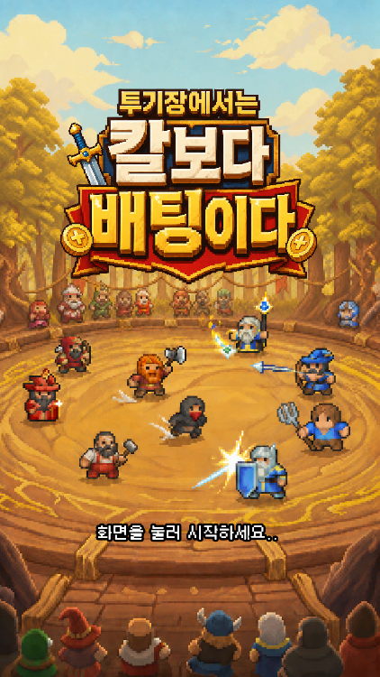

> 그림 1. 중세 콜로세움과 캐주얼 전투 콘셉트를 보여 주는 게임 대표 화면.

---

## 1. AI 활용 전체 구조

AI 활용 과정은 기획, 구현, 콘텐츠 제작, 검증의 네 단계로 나누었다.

1. **기획 지식 구조화:** 코드와 게임 규칙을 LLM 기반 구현 위키로 정리하였다.
2. **개발 보조:** Codex를 이용해 관련 파일 조사, 원인 역추적, 구현, 테스트 작성을 진행하였다.
3. **콘텐츠 제작:** ChatGPT 이미지 생성을 이용해 UI 아이콘을 만들고, ChatGPT가 작성한 음악 프롬프트를 SUNO에 입력해 BGM 후보를 제작하였다.
4. **개발자 검증:** 코드 테스트, Unity Play Mode, 실제 UI 가독성, 음악의 장면 적합성을 사람이 확인하였다.

이 구조의 목적은 AI에게 프로젝트 전체를 맡기는 것이 아니었다. 사람이 직접 하면 시간이 오래 걸리는 파일 탐색, 코드 흐름 정리, 반복 수정, 테스트 조건 작성 등을 AI에 맡기고, 팀원은 게임 규칙과 품질에 관한 판단에 집중하도록 만드는 것이었다.

문서에서는 `기획 지식 구조화 -> 개발 보조 -> 이미지·음악 제작 -> 개발자 검증` 흐름을 도식으로 정리하였다.

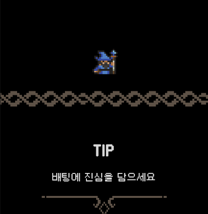

> 그림 4. AI 보조 작업을 통합한 뒤 Unity에서 직접 동작을 확인한 인게임 로딩 화면.

---

## 2. 기획 - LLM 기반 구현 위키

### 2.1 위키를 만든 이유

Unity 프로젝트의 기능은 하나의 Script만으로 결정되지 않는다. ScriptableObject 데이터, Scene과 Prefab 연결, Inspector 설정, 테스트 코드가 함께 동작한다. 기획 문서만 따로 관리하면 실제 구현이 바뀐 뒤 문서가 오래된 상태로 남기 쉽다.

이를 줄이기 위해 게임 개요, 라운드와 베팅, 자동 전투, 전투 아이템, 유닛·스테이지 데이터, 저장과 보상, UI 흐름, 런타임 구조를 Markdown·Obsidian 위키로 관리하였다. LLM은 기능을 설명할 때 먼저 실제 코드와 데이터를 확인하고, 문서에 구현 근거 경로와 확인일을 함께 기록하였다.

### 2.2 근거를 확인하는 순서

위키는 다음 순서로 근거를 판단하도록 구성하였다.

`현재 코드·데이터 -> Scene·Prefab 연결 -> 테스트 -> 최근 Git 기록 -> 기존 프로젝트 문서 -> 해석`

실행 경로가 확인된 내용만 `implemented`로 기록하고, 선언은 있지만 실제 연결을 확인하지 못한 내용은 `partial` 또는 `review`로 구분하였다. 구현과 기존 문서가 충돌하면 현재 구현을 기준으로 삼되, 의도와 다르게 보이는 내용은 임의로 확정하지 않았다.

기능 변경이 끝나면 관련 시스템 문서, 콘텐츠 목록, 변경 이력, 작업 로그의 영향 여부를 다시 확인하였다. 이 방식으로 위키를 단순한 회의 기록이 아니라 현재 게임 상태를 찾아볼 수 있는 구현 아카이브로 사용하였다.

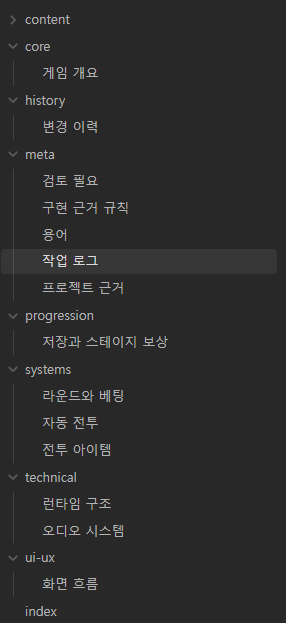

> 그림 2. 시스템별 문서가 하나의 색인과 내부 링크로 연결된 Obsidian 구현 위키 목차.

문서와 구현 근거는 `라운드와 베팅.md -> BettingPhase.cs -> BettingPhaseTests.cs -> 변경 이력` 순으로 연결하였다.

---

## 3. 위키에 사용한 주요 프롬프트와 지시 사항

### 3.1 위키 운영 지시

```text
현재 Unity 프로젝트의 실제 구현을 기준으로 한국어 Markdown 위키를 관리한다.
근거는 코드·데이터, Scene·Prefab 연결, 테스트, 최근 Git 기록 순으로 확인한다.
실행 경로가 확인된 내용만 implemented로 기록하고, 근거가 부족하면 partial 또는 review로 표시한다.
같은 설명을 여러 문서에 복사하지 말고 관련 문서를 Obsidian 내부 링크로 연결한다.
기능·게임 규칙·콘텐츠·저장·입력·UI 흐름이 바뀌면 관련 시스템 문서와 변경 이력의 영향도 점검한다.
```

### 3.2 기능 조사 프롬프트

```text
현재 구현을 먼저 조사하고 바로 문서를 작성하지 마라.
관련 Script, ScriptableObject, Scene·Prefab 연결, 테스트를 찾아 실제 실행 경로를 정리해라.
확인된 사실과 해석을 구분하고, 확인되지 않은 내용은 추정하지 말고 review로 남겨라.
최종 문서에는 근거가 된 프로젝트 상대 경로와 확인일을 기록해라.
```

### 3.3 구현 후 갱신 프롬프트

```text
최종 git diff와 변경 파일을 기준으로 위키 영향 여부를 확인해라.
게임 규칙이나 데이터 의미가 바뀌었다면 관련 시스템 문서와 목록 문서를 갱신하고,
의미 있는 사양 변경이면 변경 이력에도 남겨라.
리팩터링이나 테스트 보강처럼 외부 동작이 바뀌지 않은 작업은 사양 변경으로 기록하지 마라.
갱신 뒤 내부 링크와 중복 설명을 검사해라.
```

이 지시는 LLM이 문장을 자연스럽게 만드는 것보다, 무엇을 사실로 인정할지 결정하는 기준으로 사용하였다. 덕분에 기획자가 코드를 모두 다시 읽지 않더라도 현재 구현과 문서가 어긋난 지점을 빠르게 찾을 수 있었다.

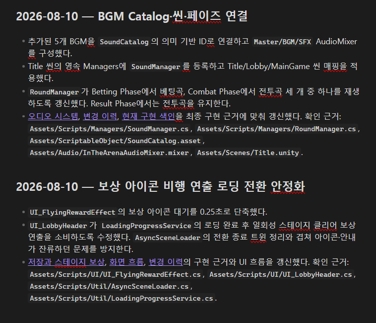

> 그림 3. BGM Catalog 연결과 로딩 전환 안정화 작업을 구현 근거 경로와 함께 기록한 위키 작업 로그.

---

## 4. 프로그래밍 - 일관된 AI 작업 과정

AI에게 바로 코드를 작성하게 하기보다 다음 순서를 반복하도록 하였다.

`요구사항 설명 -> 관련 구조 조사 -> 수정 범위 확정 -> 계획 검토 -> 구현 -> 테스트 -> Unity 직접 검증 -> 피드백 -> 최종 통합`

먼저 사용자가 원하는 결과와 현재 관찰한 현상을 설명했다. AI는 Script, Prefab, ScriptableObject, 테스트를 조사한 뒤 수정 대상과 확인 대상만 구분하였다. 범위가 정해지면 기존 구조를 유지할 수 있는지 검토하고, 구현 뒤에는 자동 테스트와 Unity Play Mode 검증을 나누어 수행하였다. 화면 배치, 애니메이션, 드래그 입력처럼 코드만으로 판단하기 어려운 부분은 팀원이 직접 실행하여 확인하였다.

### 역할별 AI와 모델 사용

자료 검색과 변경 내역 정리, 원인·계획 수립, 코드 작성, 검증, 최종 보고를 서로 다른 작업으로 나누었다. 단순 검색과 정리는 빠른 모델에 맡기고, 시스템 구조나 예외 처리처럼 판단이 중요한 작업에는 추론 성능이 높은 모델을 사용하였다. 중요한 모델이 반복적인 파일 검색에 사용량을 소모하지 않고 핵심 판단에 집중하도록 하기 위한 방식이었다.

### Git worktree를 이용한 병렬 작업

여러 AI가 같은 Unity 폴더를 동시에 수정하면 Script 충돌뿐 아니라 Compile, Play Mode, Scene·Prefab 저장이 서로 영향을 줄 수 있다. 이를 줄이기 위해 작업별 Git worktree와 Branch를 분리하고, 각 작업은 독립된 폴더에서 진행하도록 하였다. 작업이 끝나면 변경 내용과 테스트를 확인하고, 팀원이 Unity에서 직접 검증한 뒤 Main Branch에 통합하였다.

이 과정은 AI가 잘못 수정하더라도 현재 정상적으로 동작하는 작업 폴더에 즉시 영향을 주지 않으며, 작업 과정의 재현성과 검토 가능성을 높였다.

공식 OpenAI 문서에서도 Codex 활용 사례로 대규모 코드베이스의 흐름 파악, 반복 워크플로의 Skill화, 테스트와 코드 검토 같은 작업을 제시한다. 본 프로젝트에서는 이를 Unity 프로젝트의 구조 조사와 반복 검증 과정에 맞게 적용하였다.  
출처: https://learn.chatgpt.com/use-cases

---

## 5. 원인 역추적과 수정 범위 조사

### 5.1 Unit AI의 탐색 거리와 공격 거리 문제

두 근접 Unit이 서로를 Target으로 잡고 가까이 이동하지만, 일정 거리에서 공격하지 않고 함께 움직이는 현상이 있었다. AI에게 바로 수정을 요청하지 않고 다음 흐름을 역으로 확인하도록 지시하였다.

`적 탐색 -> Target 지정 -> 거리 계산 -> 이동 위치 결정 -> 공격 가능 여부 -> 공격`

분석 결과, 이동 기준과 공격 판정 기준이 서로 다른 위치를 사용하고 있었고, 근접 유닛은 단순한 Attack Range뿐 아니라 두 유닛의 실제 접촉 거리와 이동 허용 오차도 고려해야 했다. 이후 근접 유닛이 접촉 위치에서 공격할 수 있는지, 원거리 유닛이 이미 사거리 안에 있을 때 불필요하게 이동하지 않는지 테스트로 남겼다.

대표 지시 예시는 다음과 같다.

```text
두 근접 Unit이 서로를 Target으로 잡고 이동하지만 일정 거리에서 공격하지 않고 같이 움직인다.
바로 수정하지 말고 Target 탐색부터 이동, 공격 거리 계산까지 순서대로 확인해라.
Search Range, Attack Range, 실제 Unit 크기와 기준 Transform이 서로 다르게 계산되는지도 확인해라.
수정 뒤 근접·원거리 상황을 각각 회귀 테스트로 남겨라.
```

### 5.2 HP Bar의 수정 범위 조사

HP Bar 높이를 Inspector에서 변경했지만 화면에서 차이가 거의 보이지 않는 문제가 있었다. 관련 파일을 조사하자 위치는 Unit의 HitPosition을 화면 좌표로 변환한 뒤 Runtime에서 다시 계산하고 있었고, 크기도 Script 설정값이 RectTransform에 재적용되고 있었다. Prefab만 수정하는 문제가 아니라 Script의 계산과 Prefab 설정을 함께 확인해야 하는 작업이었다.

이 사례에서 AI가 줄여 준 시간은 코드 입력 시간이 아니라, Prefab·Script·Runtime 중 어느 위치에서 값이 다시 바뀌는지 찾는 시간이었다.

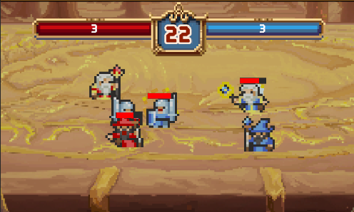

> 그림 5. Target 탐색, 거리 계산, 이동 위치와 공격 판정을 점검한 실제 전투 장면. 역추적 흐름과 Transform·Ground Root 차이는 PDF에서 문서 도형으로 표현하였다.

---

## 6. 개발 도구 제작과 안정성 보완

### SaveDebugWindow

Gold, Stage, Stars, Hearts·Tickets, Save Data 삭제를 직접 조작해 원하는 테스트 상태를 빠르게 만들기 위한 Editor Window다. 특정 스테이지나 재화 상태를 확인하기 위해 게임을 처음부터 반복하는 시간을 줄였다. Play Mode에서 가능한 Runtime 값 변경과, SaveManager 없이도 가능한 Save 삭제를 분리해 사용 조건도 명확히 하였다.

### UnitSystemMigration

구버전 Unit Prefab을 새로운 구조로 일괄 변환하는 도구다. 필요한 Child Object와 Component 연결, Rigidbody·Collider·PoolMember 설정을 같은 규칙으로 적용하였다. 많은 Prefab을 사람이 하나씩 수정할 때 생길 수 있는 누락과 설정 차이를 줄였다.

### RoundDataEditor

배열로만 보이던 RoundData의 양 팀 배치를 실제 전장과 비슷한 2×3 Grid로 표시하였다. 고정 배치와 랜덤 배치에 필요한 항목만 보여 줌으로써 스테이지 데이터 수정 과정의 실수를 줄였다.

### Battle Item Drag 예외 처리

Meteor와 Mercenary는 전장 위치를 지정해야 하므로 정상 입력만 확인해서는 부족했다. Drag를 시작한 Pointer ID를 저장하고, 다른 Pointer의 입력을 무시하며, 전장 밖에서는 `DraggingInvalid` 상태로 전환하였다. Targeting 도중 UI나 Component가 비활성화되면 상태와 전투 속도를 복구하도록 하였다. Mercenary는 세 명이 모두 전장 안에 생성될 수 있는지도 계산하였다.

이 동작은 전장 Collider 판정, 다른 Pointer의 PointerUp, 아이템 취소, 실패 시 Gold·사용 상태 복구 등의 테스트로 확인하였다.

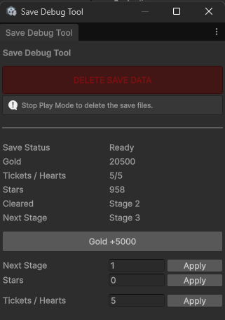

> 그림 6. Gold, Stage, Stars, Tickets·Hearts 상태를 빠르게 조작하는 Save Debug Tool.

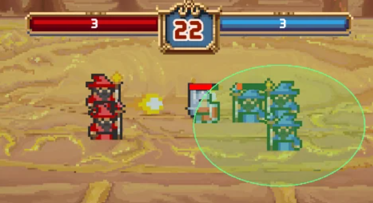

> 그림 7. 배틀 아이템 드래그 중 전장 범위와 적용 대상을 표시한 화면.

---

## 7. ChatGPT를 활용한 UI 아이콘 제작

아이콘 생성 전 게임의 배경과 기존 UI 시트를 함께 설명하였다. 한 번의 요청으로 완성하려 하지 않고, 공통 스타일을 먼저 합의한 뒤 아이콘 종류와 수정 사항을 단계적으로 전달하였다.

```text
32×32 단위의 픽셀 아이콘을 제작하려고 한다.
게임은 중세 콜로세움에서 팀에 베팅해 돈을 버는 모바일 캐주얼 게임이다.
3 Match Puzzle처럼 밝고 읽기 쉬운 스타일로 만들고, 첨부한 UI 시트의 금색·베이지 장식과 짙은 배경색을 기준으로 한다.
작은 크기에서도 구분되는 실루엣, 투명 배경 PNG, 텍스트와 워터마크 제외 조건을 유지한다.
```

먼저 골드, 입장권, 별, 지폐 아이콘을 제작하고, 이후 옵션·스테이지·소셜·유닛 메뉴, Meteor·용병 고용·연장전 배틀 아이템, 능력치, 상태 표시, 3단계 상자 아이콘으로 확장하였다. 초안이 게임의 의미와 다를 때는 “입장권을 월계관 문양으로 변경”, “하트를 별로 교체”, “지폐의 중앙 문양까지 녹색으로 통일”처럼 수정 대상을 구체적으로 지정하였다.

생성 결과는 후보 선별, 투명 배경 정리, 32×32 크기 조정, 아이콘 시트 구성 과정을 거쳤다. Unity에서는 픽셀 경계가 흐려지지 않도록 Point Filter로 가져와 실제 UI 크기에서 가독성을 확인하였다.

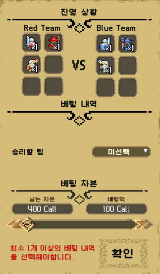

> 그림 8. 팀·재화 아이콘이 실제로 적용된 베팅 화면.

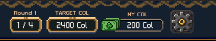

> 그림 9. 재화와 옵션 아이콘이 적용된 인게임 상단 HUD.

---

## 8. ChatGPT와 SUNO를 활용한 BGM 제작

BGM은 ChatGPT에 게임 장면과 필요한 길이를 설명해 SUNO 입력용 프롬프트를 작성한 뒤, SUNO에서 여러 후보를 생성하는 방식으로 제작하였다. 단순히 “중세 음악”을 요청하면 어둡고 웅장한 곡이 나오기 쉬워, 밝은 모바일 캐주얼 게임, 축제형 콜로세움, 귀여운 검투사, 금화를 거는 관중이라는 장면 정보를 함께 제공하였다.

전투가 30초 안에 끝나는 구조이므로 전투곡에는 즉시 시작, 짧은 전개, 보컬 없음, 어두운 판타지 제외 조건을 넣었다. 대표 프롬프트는 다음과 같다.

```text
Exactly 30-second instrumental battle loop for a colorful medieval casual mobile game.
Start the main rhythm immediately with no intro. Energetic lute, fast fiddle, frame drums,
tambourine, hand claps and bright brass accents. Cute gladiators clash inside a lively
colosseum while spectators cheer and bet gold coins. Playful, exciting and slightly chaotic.
Instrumental only, no vocals, no choir, no fade-out, no dark fantasy or cinematic intro.
```

타이틀은 밝고 장난스러운 주제 선율, 베팅 페이즈는 동전 소리와 계산하는 긴장감, 전투는 빠른 타악기와 즉시 시작되는 리듬을 중심으로 각각 다른 프롬프트를 사용하였다. 생성 서비스가 요청한 길이를 정확히 지키지 않을 수 있으므로 후보곡을 비교하고, 실제 장면에 사용할 구간 선택과 길이 편집은 개발자가 수행하도록 계획하였다.

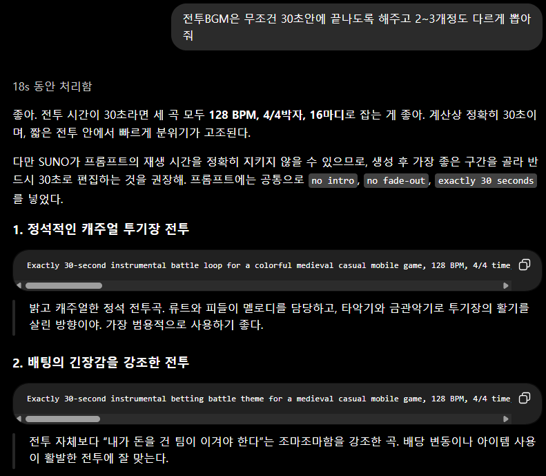

> 그림 10. 30초 전투 구조와 BPM·박자·금지 조건을 반영해 SUNO용 프롬프트를 작성한 화면.

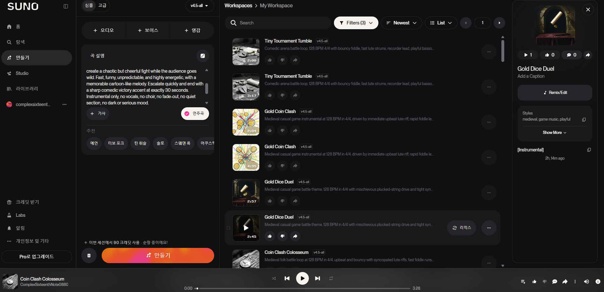

> 그림 11. 작성한 프롬프트로 여러 BGM 후보를 생성하고 비교한 SUNO 작업 화면.

제작 흐름은 `상황 정의 -> 프롬프트 작성 -> SUNO 생성 -> 후보 비교 -> 30초 편집 -> Unity 적용`으로 정리하였다.

---

## 9. 외부 에셋·오픈소스 출처

| 구분 | 명칭 | 사용 위치·목적 | 출처 | 라이선스·비고 |
|---|---|---|---|---|
| 오픈소스 | DOTween | UI와 연출 Tween | https://dotween.demigiant.com | DOTween 라이선스 |
| 상용 확장 | DOTween Pro | Animation·Path 등 Unity 확장 | https://dotween.demigiant.com/pro.php | 프로젝트 참여자별 유효 라이선스 필요 |
| 오픈소스 | MCP for Unity | AI와 Unity Editor 연동 | https://github.com/CoplayDev/unity-mcp | MIT |
| 오픈소스 | Unity SerializeReferenceExtensions | SerializeReference Inspector 지원 | https://github.com/mackysoft/Unity-SerializeReferenceExtensions | 저장소 라이선스 기준 |
| 외부 에셋 | Pixel Sprite Effects pack | 전투 VFX | 프로젝트 내 사용 | 원 구매 기록 기준 |
| 외부 에셋 | RPG Icons Pixel Art | 스킬·UI 아이콘 | 프로젝트 내 사용 | 원 구매 기록 기준 |
| AI 생성 | ChatGPT 생성 아이콘 | 재화·메뉴·배틀 아이템·능력치 UI | ChatGPT 생성 기록 | 선별·후편집·Unity 적용 |
| AI 생성 | SUNO 생성 BGM 후보 | 타이틀·베팅·전투 음악 | SUNO 생성 기록 | 후보 비교와 길이 편집 필요 |

## 10. 결론

이번 프로젝트에서 AI를 사용하며 가장 크게 줄어든 것은 단순한 코드 입력 시간이 아니었다. 문제가 어느 파일에서 시작되는지 찾는 시간, 여러 Prefab을 같은 규칙으로 수정하는 시간, 테스트 상태를 반복해서 만드는 시간, 예외 상황과 회귀 조건을 정리하는 시간이 줄었다.

반대로 AI가 만든 결과를 그대로 최종 결과로 인정하지 않았다. 구현 위키는 실제 코드와 테스트를 근거로 갱신했고, 코드 변경은 자동 테스트와 Unity Play Mode로 확인했다. 아이콘은 실제 UI 크기에서 다시 선별했고, 음악은 게임 장면과 길이에 맞는지 사람이 비교하도록 하였다.

최종 작업 과정은 다음과 같이 정리할 수 있다.

`문제 또는 아이디어 정의 -> AI 조사·초안 -> 팀원 판단 -> 구현·생성 -> 테스트·실행 확인 -> 피드백 수정 -> 검증된 결과만 통합`

AI는 개발자를 대신하는 도구보다, 판단 전에 필요한 조사와 반복 작업을 맡아 주는 개발 보조 도구로 가장 유용하게 사용되었다.

### 제공 이미지 수록 확인

| 번호 | 이미지 | 수록 위치 |
|---:|---|---:|
| 1 | 게임 대표 이미지 | 1쪽 |
| 2 | Obsidian 목차 | 3쪽 |
| 3 | Obsidian 내용 | 4쪽 |
| 4 | SaveDebugTool | 7쪽 |
| 5 | 인게임 전투 이미지 | 6쪽 |
| 6 | 인게임 드래그 범위 | 7쪽 |
| 7 | 인게임 로딩 이미지 | 2쪽 |
| 8 | 인게임 베팅 화면 | 8쪽 |
| 9 | 인게임 상단 UI | 8쪽 |
| 10 | ChatGPT BGM 프롬프트 | 9쪽 |
| 11 | SUNO 페이지 | 9쪽 |

---

### 작성 근거

- 프로젝트 코드와 테스트: `Assets/Scripts`, `Assets/Editor`
- 구현 위키: `D:/WIKI/TKB/wiki`
- Unity 패키지: `Packages/manifest.json`
- DOTween 안내 및 라이선스 링크: `Assets/Plugins/Demigiant/DOTween/readme.txt`
- Codex 활용 사례: https://learn.chatgpt.com/use-cases
